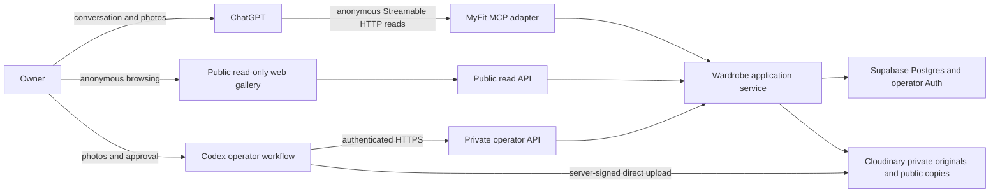
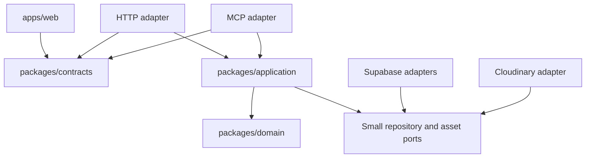
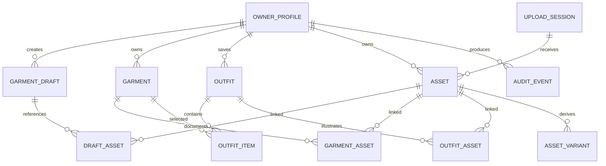
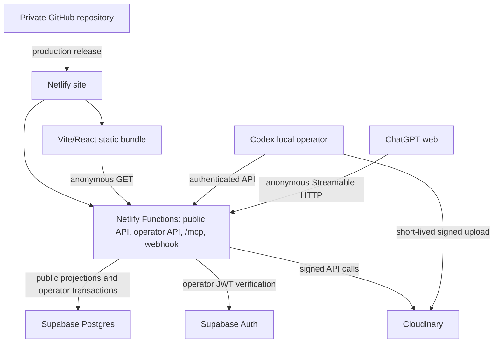

# MyFit Architecture Design

**Status:** Proposed for V1 implementation  
**Research date:** 2026-07-29  
**Scope:** Architecture and planning only

## 1. Executive summary

MyFit should be a small personal wardrobe system whose permanent memory is an external service, whose conversational interface is ChatGPT, and whose website is a publicly readable, read-only visual browser. "Publicly readable" applies only to deliberately published canonical records and approved presentation assets; drafts, raw originals, operator functions, and private owner notes remain private.

The recommended V1 is one TypeScript monorepo and one Netlify deployment containing:

- A Vite/React read-only web client.
- Anonymous read HTTP functions under `/api/public/v1` and authenticated operator functions under `/api/operator/v1`.
- An anonymous, read-only, stateless Streamable HTTP MCP endpoint under `/mcp`.
- Shared domain/application code used directly by both transports.

Supabase supplies Postgres, single-owner operator authentication, and Row Level Security (RLS). Cloudinary stores immutable raw originals using authenticated delivery and separate, explicitly approved presentation copies using public delivery. Netlify hosts the web bundle and short-lived functions. This is three managed vendors, but each has a distinct job. Cloudinary is justified over Supabase Storage because a photo-heavy wardrobe can exceed Supabase's 1 GB free storage quickly, while Cloudinary's current free allowance is 25 shared credits and includes transformations and delivery.

The design deliberately avoids microservices, queues, embeddings, a browser chatbot, and a large admin application. Draft AI extraction is stored separately from canonical garments. Approval is a revision-checked transaction. Originals are immutable. Generated media is never documentary evidence. Per-field provenance is sparse and only added where it changes how a fact should be trusted.

There are two important launch constraints:

1. Current OpenAI documentation does **not** support the brief's assumption that a Plus-style individual plan can perform write-capable custom MCP operations. As researched on 2026-07-29, full read/write MCP is available to Business and Enterprise/Edu, while Pro is limited to read/fetch; custom apps are currently web-only. MVP therefore uses an anonymous read-only MCP server and exposes safe writes only through its authenticated Codex operator workflow.
2. Official documentation describes MCP tool inputs as JSON-schema objects but does not document automatic forwarding of a conversation's image attachments into a custom tool call. MVP ingestion therefore happens only through Codex, where local attachment/file access is available. A future mobile upload handoff can be designed later without blocking the remote read experience.

## 2. Product definition

MyFit is a personal record of one person's real wardrobe and deliberately saved outfits. The owner has chosen public read access for the MVP publication surface.

- The database is the source of truth.
- ChatGPT performs dynamic styling and garment reasoning.
- Chat history and ChatGPT memory are not data stores.
- The website is an anonymous visual browser, not the primary authoring surface.
- Canonical records favor objective, owner-specific, and stable facts.
- Reachability is exactly one boolean meaning "the owner can currently use this garment."
- Human approval separates proposed AI extraction from canonical data.

The owner profile exists once and provides practical styling context. It must not be used for body scoring, criticism, or idealization.

## 3. Firm requirements

The following are architecture invariants:

- Every domain object has a UUID.
- Every canonical garment and saved outfit has a schema version.
- `garments.reachable` is `boolean not null default true`; there is no location, reason, laundry, packing, or availability state machine.
- Originals are immutable provider assets. An update creates a new asset.
- Source, derived, generated, collage, and real-worn assets remain distinguishable.
- The user explicitly saves outfits; suggestions are not persisted automatically.
- Category-specific data is versioned and validated, not an untyped JSON dumping ground.
- User-facing category, system category, and alternative terms can disagree constructively.
- Detailed color prose and searchable color families are both stored.
- The web gallery has no garment creation, editing, reachability toggle, or AI chat controls.
- MCP exposes narrow domain operations, never raw SQL or generic database mutation.
- Public reads return only published canonical projections and approved public presentation assets.
- All draft, raw-asset, operator, and write operations require the authenticated owner.
- Sample images remain fixtures and are never imported merely because a deployment runs.

## 4. Non-goals

V1 excludes:

- 3D garments, cloth simulation, body scanning, avatars, or exact virtual fitting.
- Shopping, store inventory, resale, social or public profiles.
- Laundry, city/country, packing, borrower, calendar, weather, or wear analytics.
- Daily automatic planning or a browser recommendation engine.
- Custom vision-model training or embeddings.
- Native mobile applications.
- Multi-user SaaS, billing, automatic provisioning, or account linking.
- A browser AI chatbot.
- Automatic persistence of suggestions.
- Generated previews or collages as a required implementation feature; the schema only permits storing them later.

## 5. Primary user journeys

### 5.1 Find reachable garments

1. The user asks ChatGPT for reachable jackets.
2. ChatGPT calls `search_garments` with `reachable=true` and `category="jacket"`.
3. The application normalizes category aliases and searches canonical records only.
4. ChatGPT reasons over returned facts and source-image references.

The website performs the same read through `GET /api/public/v1/garments`.

### 5.2 Add a garment with photographs through Codex

1. The user starts a Codex task with local or attached photographs.
2. Codex visually distinguishes observed facts, user statements, manufacturer statements, inferences, and unknowns.
3. Codex writes a temporary proposed manifest outside canonical storage and presents the useful facts, uncertainty, missing views, and proposed categories.
4. The user corrects or explicitly approves the proposal in the Codex task.
5. Only after approval, the local operator tool authenticates to the private operator surface of the public HTTPS wardrobe API, creates the draft, uploads original files directly to Cloudinary with server-signed parameters, and identifies exactly which metadata and sanitized presentation copies should be published.
6. The backend verifies and registers assets, creates and publishes the canonical garment transactionally, publishes only the approved presentation copies, and writes an audit event.
7. ChatGPT can retrieve the new garment through the remote MCP read tools.

There is no mobile upload page and no assumption that a ChatGPT conversation attachment can become an MCP tool argument in MVP.

Attachment/upload options were resolved as follows:

| Option                                                       | Finding                                                                                                                                    | V1 decision                |
| ------------------------------------------------------------ | ------------------------------------------------------------------------------------------------------------------------------------------ | -------------------------- |
| ChatGPT attachment reference passed to MCP                   | Official tool contracts define JSON-schema inputs but do not document an automatic, durable attachment reference available to custom tools | Do not depend on it        |
| Image bytes/base64 in an MCP argument                        | Inflates requests, conflicts with serverless/body limits, and lacks a documented ChatGPT handoff                                           | Reject                     |
| Backend-generated signed upload URL                          | Secure and practical, but still needs a client that can read the local file                                                                | Use through Codex/operator |
| Tiny private upload page                                     | Feasible future phone handoff, but adds an auth and UI surface the owner does not need for MVP                                             | Postpone                   |
| Direct Cloudinary unsigned upload                            | Simple but too broad and abuse-prone                                                                                                       | Reject                     |
| Codex local file access plus signed direct Cloudinary upload | Available in the chosen MVP environment; bytes bypass Netlify and the operator can present an approval manifest                            | Recommended                |

### 5.3 Change reachability

In MVP, Codex performs this authenticated operator action. The conversational MCP version is the intended later journey:

1. The user states that a garment is unavailable.
2. ChatGPT resolves the garment ID through search.
3. `set_garment_reachable` receives the ID, `reachable=false`, expected garment revision, and an idempotency key.
4. The domain service updates only the boolean, increments the revision, and writes an audit event.

No location or reason is requested or persisted.

### 5.4 Save and retrieve an outfit

In MVP, ChatGPT may propose an outfit but Codex/operator performs the explicit save; MCP can immediately read back published saved outfits. A later write-capable MCP connection can perform the following flow directly:

1. ChatGPT proposes an outfit at runtime.
2. Only after the user says to save it, ChatGPT calls `save_outfit`.
3. The application validates every garment ID belongs to the owner and stores an ordered membership list.
4. Searches use text/tags and an indexed garment-membership join.

Saved outfits remain historically valid even if a garment later becomes unreachable.

## 6. System context



## 7. Recommended architecture

Use a pnpm TypeScript monorepo in the later implementation phase:

```text
apps/
  web/                 Vite + React public read-only SPA
  server/              Netlify Functions for HTTP API, MCP, and webhooks
packages/
  domain/              entities, policies, schemas, errors
  application/         use cases and authorization-aware service boundary
  persistence/         Supabase repositories and migrations-facing types
  assets/              Cloudinary signing, delivery, callback verification
  contracts/           shared HTTP/MCP DTO schemas
tools/
  operator/            Codex-driven draft, upload, approval, and maintenance CLI
  sample-import/       explicit fixture import command
  export/              portable metadata and asset backup command
supabase/
  migrations/          append-only SQL migrations
samples/               unchanged local fixtures
docs/                  design artifacts
```

This is one repository and one application deployment, not a service fleet. Packages enforce dependency direction:



The MCP and HTTP adapters call the same in-process application service. They do not call each other over the network. This keeps the service boundary explicit without paying for a self-HTTP hop.

### Architecture enforcement

- Domain and application packages cannot import Netlify, MCP, React, Supabase SDK, or Cloudinary SDK.
- Transport adapters validate external DTOs before calling application services.
- Persistence code does not contain styling decisions.
- Web code never receives the Supabase service-role key or Cloudinary API secret.
- The only provider interface worth defining in V1 is an `AssetStore`, because exportability and possible provider replacement are real requirements. Do not create speculative interfaces for every library.

## 8. Deployable components

### 8.1 Netlify site

One production site contains:

- Static Vite/React assets.
- Read-only routes: catalog, garment detail, saved outfits, outfit detail.
- Anonymous catalog and outfit routes with no sign-in or cookies.
- Netlify Functions routed to `/api/public/v1/*`, `/api/operator/v1/*`, `/mcp`, and `/webhooks/cloudinary`.

Normal MCP tool calls are short, buffered responses. The endpoint uses stateless Streamable HTTP so it does not rely on sticky sessions or a long-lived SSE connection. Netlify's current 60-second synchronous limit is adequate; the implementation should set an internal deadline below 10 seconds for ordinary reads/writes. Streaming is not required for V1.

### 8.2 Supabase project

Supabase provides:

- Postgres tables, indexes, constraints, RLS, and transactions.
- The one operator identity for Codex-driven writes.
- Private operator sessions/tokens; the public site and MVP MCP endpoint do not authenticate readers.
- Asymmetric JWT signing and JWKS-based verification.

Supabase's OAuth 2.1 server is not needed for the public read-only MVP. It remains the leading later option for write-capable MCP because it avoids a fourth vendor and is explicitly documented for MCP, but its current beta status must be re-evaluated before enabling MCP writes.

### 8.3 Cloudinary product environment

Cloudinary stores:

- Immutable originals as `type=authenticated`.
- Separate, EXIF-stripped, explicitly approved public presentation assets for catalog and thumbnail display.
- Later optional cutouts, collages, generated previews, and real outfit photographs.

The application stores provider IDs and transformation definitions. Published presentation assets use stable public delivery URLs derived from those identifiers. A sanitized copy of a documentary photograph is labeled as a `documentary_source_presentation`, distinct from a generated or materially transformed image and distinct from the private immutable original. Private originals use short-lived signed delivery URLs only in authenticated operator/export flows.

## 9. Domain model



Domain invariants are implemented in application services and repeated as database constraints where practical.

## 10. Canonical garment model

Canonical garments use relational columns for identity, common filtering, concurrency, and common objective facts, plus one validated JSONB field for category-specific attributes.

Common fields:

- `id`, `owner_id`, `schema_version`, `revision`.
- `display_name`, `brand`.
- `user_category`, `system_category`, `alternative_terms[]`.
- `reachable boolean`.
- `color_description`, `color_families[]`.
- `pattern_description`.
- `materials jsonb[]` as structured material statements.
- `construction_details[]`, `visible_details[]`.
- `silhouette`, `fit_on_owner`, `length_on_owner`.
- `thermal_weight`, `weather_characteristics[]`, `layering_role`.
- `labelled_size` nullable; unknown stays `null`.
- `owner_notes[]`.
- `category_attributes jsonb`.
- `provenance jsonb`.
- `created_at`, `updated_at`, and nullable `published_at`.

`category_attributes` is a discriminated, versioned payload:

```json
{
  "kind": "outerwear",
  "version": 1,
  "collar": "point collar",
  "closure": ["button front"],
  "hem": "curved",
  "sleeveConstruction": "set-in",
  "pockets": ["two flap chest pockets"],
  "insulation": "none"
}
```

Initial schema kinds are `outerwear`, `top`, `trousers`, `footwear`, `jewellery`, `bag`, and `accessory`. A new kind or version requires a validator, fixtures, and migration/upgrade logic. Unknown or uncommon details can stay in objective free-text arrays rather than forcing a false taxonomy.

### Provenance and uncertainty

Human approval applies to the record as a whole. A sparse `provenance` map records only facts for which origin or uncertainty matters:

```json
{
  "/materials/0/name": {
    "sourceKind": "model_inference",
    "confidence": "low",
    "status": "inferred",
    "note": "Appears suede-like in photographs; not label-verified."
  },
  "/materials/2/name": {
    "sourceKind": "user_provided",
    "confidence": "high",
    "status": "unknown",
    "note": "Exact composition not provided."
  }
}
```

Allowed `sourceKind` values are `user_provided`, `direct_observation`, `manufacturer_claim`, `model_inference`, and `system_derived`. Allowed status values are `confirmed`, `inferred`, `disputed`, and `unknown`. `sourceAssetId` or a short `sourceReference` may be included. Confidence is `high`, `medium`, or `low`.

Do not wrap every field in `{value, confidence}`. User-provided, human-approved facts need no redundant entry. Unknown facts are `null` or omitted; never use guessed placeholder strings such as `"M or L"`.

## 11. Draft extraction and approval

`garment_drafts` stores:

- Its own UUID, owner, schema version, and integer revision.
- A full proposed garment payload.
- Sparse extraction provenance and uncertainty.
- Lifecycle status: `draft`, `approved`, `rejected`, or `superseded`.
- Optional source-conversation summary, not a raw conversation transcript.
- Creation/update/decision timestamps and the resulting garment ID.

Draft assets are associated separately. An upload does not approve a draft.

Approval requires:

1. Authenticated owner.
2. `status=draft`.
3. Exact `expectedRevision`.
4. Canonical schema validation.
5. Required source-asset checks for the category.
6. Verified Cloudinary assets owned by the same owner.
7. A unique idempotency key.

Approval runs in one transaction:

- Lock draft.
- Re-check revision/status.
- Create garment with `published_at` only when the approved command explicitly requests publication.
- Transfer draft-asset links to garment-asset links.
- Link only the explicitly approved, sanitized public presentation assets to the public projection; raw originals remain private.
- Mark draft approved and record `approved_garment_id`.
- Append an audit event.
- Commit and return the canonical garment.

Cloudinary cannot participate in the Postgres transaction. Before that transaction, the application reserves private/pending derivative rows with opaque provider IDs and creates the selected public presentation objects. The transaction verifies and promotes exactly those rows. On failure, the application deletes the orphaned provider objects best-effort; a maintenance reconciliation removes any stale pending objects. Public API serialization still requires the committed database `visibility=public` and `published_at`, so a partial operation is never advertised.

Worn photographs are required for fit-sensitive categories unless an explicit, auditable exception is provided. V1 policy:

- `outerwear`, `top`, `trousers`: at least one worn source; worn front and back recommended.
- `footwear`: at least one worn source.
- `jewellery`, small `accessory`, and some `bag` records: no worn source required.

The API reports missing recommended roles but does not make ingestion bureaucratic. Measurements are never globally required.

## 12. Outfit model

`outfits` stores a stable ID, owner, schema version, revision, title, original user request, short rationale/notes, optional tags, created/updated timestamps, nullable `published_at`, and optional `archived_at`. Only published outfits appear on anonymous surfaces.

`outfit_items` stores ordered garment IDs with an optional neutral role such as `outer_layer`, `top`, `bottom`, `footwear`, or `accessory`. It has a unique `(outfit_id, garment_id)` constraint.

Outfit assets use explicit roles:

- `deterministic_collage`
- `generated_worn_preview`
- `real_worn_photo`

Generated previews carry `asset_class=generated` and a disclaimer. They never replace garment source photographs.

## 13. Owner profile

One `owner_profiles` row is keyed by the Supabase auth user ID:

- `schema_version`, `revision`.
- `gender_context`: `"male"` for styling language.
- `age_range`: `"20s"` as a user-maintained approximation.
- `height_cm_approx`: `180`.
- `weight_kg_visualization_approx`: `80`.
- `shoe_size_system`: `"EU"`.
- `shoe_size_approx`: `44`.
- `typical_clothing_size`: `"L"`.
- Optional practical notes and future private body-reference asset links.

These values must not be copied into garment rows. Garment-labelled size is independent and remains unknown until observed.

The public `OwnerProfileView` is an allowlisted DTO containing only the seven styling fields above. Private notes, identity data, authentication identifiers, and any future body-reference assets are never part of that projection. The owner has explicitly accepted that the listed approximate styling fields are publicly readable for MVP.

## 14. Asset and image model

An `assets` row represents one stored media object:

- UUID and owner.
- Provider (`cloudinary` in V1).
- Stable provider `asset_id`, current `public_id`, resource/delivery type, and provider version.
- `asset_class`: `source`, `derived`, or `generated`.
- Optional parent asset ID.
- `visibility`: `private` or `public`; default `private`.
- Nullable `published_at`; public delivery is forbidden until this is set by an explicit approval command.
- MIME type, bytes, width, height, checksum where available, and original filename.
- Creation source and timestamps.
- Verification status and immutable flag.

Association tables give the same asset a domain role without polymorphic foreign keys:

- `draft_assets`
- `garment_assets`
- `outfit_assets`
- future `owner_assets`

Source garment roles are `alone_front`, `alone_back`, `detail`, `label_material`, `worn_front`, `worn_back`, `worn_side`, and `other`.

`asset_variants` records a named derivative (`catalog`, `thumbnail`) and exact transformation specification. A private original and a public presentation copy are separate `assets` rows linked by `parent_asset_id`; making a transformation request must never implicitly make the original public.

### Immutability

- Signed upload parameters force `overwrite=false`, a server-generated unique public ID, `type=authenticated`, accepted MIME types, maximum bytes, and the intended owner/session context.
- Provider secrets never reach the browser.
- Upload callbacks are signature-verified and idempotent.
- An attempted second registration of a provider `asset_id` is harmless.
- Replacing an image creates a new asset and supersedes the association; the original remains until an explicit retention/export policy permits deletion.
- Originals may retain EXIF for documentary fidelity in private storage. Public presentation copies always strip EXIF and use an explicit crop/role selected during approval.
- The fixture review found visible faces and home interiors in worn photographs. The operator must warn before publishing such a copy and should prefer flat-lay or privacy-cropped images unless the owner explicitly approves the visible context.

## 15. Search model

At hundreds of garments, Postgres search is sufficient.

- A stored/generated `tsvector` combines display name, brand, user category, system category, aliases, color description, pattern, materials, visible details, and owner notes.
- A GIN index supports `websearch_to_tsquery`.
- GIN indexes support `color_families[]`, `alternative_terms[]`, and outfit `tags[]`.
- B-tree indexes cover `(owner_id, reachable)`, `(owner_id, system_category)`, timestamps, and joins.
- Category alias normalization occurs before the query so `"jacket"` can match an `"outerwear"` system kind or `"overshirt"` alternative term.
- Filters are structured and parameterized. Search text has a conservative maximum length.
- Search never includes raw draft payloads unless a draft-specific operation explicitly requests them.

No Elasticsearch, vector database, embeddings, or browser-side recommendation model is justified.

## 16. API boundary

The HTTP API is the stable transport boundary. It has two deliberately separate surfaces:

- `/api/public/v1`: anonymous `GET` endpoints returning only `published_at is not null` canonical projections and `visibility=public` presentation assets. These routes never return provider metadata for private assets, drafts, audit data, authentication IDs, or private owner notes.
- `/api/operator/v1`: authenticated Codex/operator reads and writes. Writes require a valid owner token, idempotency key, validation, and expected revision where relevant.
- Browser code never queries Supabase tables directly.
- The MCP adapter calls the same application services and maps service errors into MCP tool results.

Detailed endpoints and contracts are in [docs/MCP_AND_API.md](docs/MCP_AND_API.md).

## 17. Proposed MCP tools

The full target tool surface is listed below, but MVP exposes only the five anonymous read tools marked **MVP**. They return the same published projections as `/api/public/v1`. Codex uses authenticated HTTP/operator commands for ingestion. Write-capable MCP tools are enabled later only when the owner's ChatGPT plan and end-to-end confirmation behavior support them.

1. `search_garments` — **MVP**
2. `get_garment` — **MVP**
3. `create_garment_draft`
4. `get_garment_draft`
5. `update_garment_draft`
6. `approve_garment_draft`
7. `update_garment`
8. `set_garment_reachable`
9. `save_outfit`
10. `search_outfits` — **MVP**
11. `get_outfit` — **MVP**
12. `get_owner_profile` — **MVP**

`get_garment` includes assets, so there is no separate `list_garment_assets`. The Codex operator pipeline registers uploaded assets through narrow HTTP operations, so there is no generic MCP `attach_asset`. V1 omits delete; later `archive_outfit` can be added as a reversible operation if the user needs it.

Tool metadata must accurately mark reads, writes, idempotence, and destructive behavior. Approval, canonical update, reachability change, and outfit save are write actions.

## 18. Authentication and authorization

### Website

- No reader authentication, account, cookie, or public sign-up.
- The web bundle calls only `/api/public/v1`.
- Read-only behavior is enforced server-side, not merely by hiding controls.

### Private operator API

- Supabase Auth email magic link or password for one pre-created owner; no public sign-up.
- Verify JWT signature using Supabase JWKS.
- Verify issuer, expiry, audience, and required claims.
- Map `sub` to `owner_id`.
- Use a user-scoped Supabase client so RLS remains active. Service-role access is restricted to verified webhooks and maintenance operations.

### MCP

- MVP read tools use `noauth` because their data is intentionally public.
- The MCP adapter is structurally unable to invoke operator use cases; it imports only public-read application interfaces.
- Apply conservative request limits and pagination because public means scrapeable.
- If write MCP is added later, add OAuth 2.1 with PKCE, full token validation, owner-scoped RLS, narrow write tools, confirmation annotations, and audit events. Re-evaluate Supabase's beta OAuth server at that time. Standard OAuth scopes do not replace table authorization.

### Deployment administration

- GitHub, Netlify, Supabase, and Cloudinary accounts use MFA.
- Secrets are held only in provider secret stores and local ignored environment files.
- Production deploys originate from the protected GitHub repository.

## 19. Privacy and threat model

| Threat                                                            | Control                                                                                                                                               |
| ----------------------------------------------------------------- | ----------------------------------------------------------------------------------------------------------------------------------------------------- |
| Accidental disclosure outside the chosen public subset            | Explicit `published_at`, allowlisted public DTOs, separate public routes, and tests proving drafts/private fields cannot serialize                    |
| Raw originals, faces, or home interiors published unintentionally | Originals stay `authenticated`; public copies are separate assets; Codex presents an exact publication manifest and warns on visible personal context |
| Public scraping and hotlinking                                    | Accepted consequence of public reads; pagination, rate limits, cache headers, Cloudinary usage alerts, and no stable URLs for private originals       |
| Leaked Cloudinary secret                                          | Secret exists only in Netlify Functions and the controlled local operator environment; direct uploads use narrow short-lived signatures               |
| Cross-user leaks later                                            | `owner_id` on every owned row, composite ownership checks, RLS from day one                                                                           |
| Generic MCP mutation                                              | No SQL tool, no arbitrary table/field path, explicit allowlisted patch fields                                                                         |
| Prompt injection in garment text                                  | Stored text is treated as untrusted data, never server instructions; output delimiters and server validation                                          |
| Model hallucinates facts                                          | Draft/canonical split, sparse provenance, human approval, unknown stays unknown                                                                       |
| Duplicate/retried writes                                          | Idempotency records plus request hashing and transactional unique constraints                                                                         |
| Lost updates                                                      | Integer revision and required `expectedRevision`                                                                                                      |
| Search abuse                                                      | Length/limit caps, structured filters, parameterized SQL, rate limiting                                                                               |
| Webhook forgery                                                   | Cloudinary signature and timestamp verification                                                                                                       |
| Private signed URL sharing                                        | Short TTL, operator-only generation, and no private URLs in durable public data or logs                                                               |
| Sensitive logging                                                 | Correlation IDs and redacted diffs; no tokens, raw images, full prompts, or signed URLs                                                               |

Published records and presentation images are intentionally available to anyone with the URL and may be copied. This is a product decision, not an access-control guarantee. Private originals still use signed URLs; a recipient of a still-valid private URL can use it until expiry.

## 20. Deployment architecture



The MCP endpoint is stateless and anonymous. Each request completes without server-affine session state and can invoke only published-read use cases. Codex-run uploads bypass Netlify's body-size limit by sending bytes directly from the authenticated local operator tool to Cloudinary after obtaining a narrow server signature.

## 21. Vendor selection and rationale

### Supabase: selected for data and operator identity

Reasons:

- Full Postgres with relational integrity, JSONB, full-text search, migrations, and RLS.
- One identity system for private Codex/operator writes.
- RLS remains valuable around private tables even though published DTOs are anonymous.
- Free quotas are ample for metadata.

Tradeoffs:

- OAuth 2.1 server is beta and deliberately postponed because MVP MCP is read-only and public.
- Free projects can pause after one week of inactivity.
- Free storage is 1 GB and image transformations require Pro, so Storage is not selected for garments.

### Cloudinary: selected for assets

Reasons:

- Current free plan has 25 shared monthly credits; one credit equals 1 GB storage, 1 GB image bandwidth, or 1,000 transformations.
- Signed direct browser upload avoids routing photo bytes through functions.
- Authenticated originals, separately public presentation copies, transformations, CDN, and durable provider IDs fit the domain.

Tradeoffs:

- Authenticated originals cannot use arbitrary on-the-fly transformations; public presentation copies must be created intentionally.
- Two visibility classes require exact provider-policy and serialization tests.
- Credits combine storage, transformation, and bandwidth; usage needs monitoring.

### Netlify: selected for web plus server

Reasons:

- One deployment for static web and Node-compatible TypeScript functions.
- Custom domains/SSL, previews, functions, secret management, and rate limiting.
- Current synchronous function limit is 60 seconds, adequate for short domain operations.
- Avoids a separate backend host.

Tradeoffs:

- New free accounts use 300 monthly credits and a production deployment consumes 15; production releases must be intentional.
- The free site pauses at the credit limit.
- Streamed responses have a 10-second limit; V1 does not depend on streaming.

### Why not use only Supabase

Supabase Edge Functions plus Storage would reduce vendors, but free Storage is only 1 GB and transformations are Pro-only. A real wardrobe with several original phone photographs per garment can exceed this. Deno Edge Functions also add runtime variance while the rest of the stack is Node/TypeScript. The simpler operational code path is Netlify Functions plus Cloudinary.

## 22. Free-tier and cost considerations

The design can start at $0, but "free" is a quota and reliability choice, not a guarantee:

- Supabase Free: 500 MB database, 1 GB file storage (unused for garments), 5 GB egress, 500,000 Edge Function invocations, 50,000 MAU, and two active projects. Free projects pause after a week of inactivity.
- Cloudinary Free: 25 credits shared by storage, transformation, and bandwidth over current/rolling usage rules.
- Netlify Free: 300 credits/month. Current meters include 15 credits per production deploy, 20/GB bandwidth, 10/GB-hour function compute, and 2/10,000 web requests.

Operational policy:

- Use deploy previews freely; batch production releases.
- Set Cloudinary upload caps and generate only two eager variants.
- Monitor usage monthly.
- Cache approved public presentation images aggressively by immutable provider version; keep private-original URLs short-lived.
- Accept manual Supabase reactivation during early V1, or upgrade to Supabase Pro when always-on reliability matters.
- Do not build artificial keep-alive traffic to evade provider inactivity policy.

## 23. Backup and export

Free Supabase does not include guaranteed user-accessible automatic backups. V1 therefore requires an owner-run export command before declaring production ready.

The export bundle contains:

- Versioned JSON manifests for owner, garments, provenance, outfits, associations, and audit metadata.
- A SQL `pg_dump` for full relational recovery.
- Every original and stored generated asset downloaded by provider asset ID.
- Asset checksums and a manifest that maps UUIDs to provider IDs and local paths.
- No live signed delivery URLs.

Exports are timestamped, encrypted or stored on an encrypted owner-controlled drive, and tested by schema validation. Monthly manual export is sufficient initially; later a scheduled encrypted export may be added. Database migrations remain in Git.

## 24. Observability and audit

- Every request gets a correlation ID returned in errors and logs.
- Netlify logs initialization failures, latency, status, tool name, and correlation ID, but not tokens, prompts, signed URLs, or garment text.
- `audit_events` records every domain write: actor owner, client ID, channel (`http`, `mcp`, `webhook`, `import`), action, target, redacted before/after diff, idempotency key, and timestamp.
- Cloudinary callbacks and Codex operator actions are auditable.
- Health checks cover API process and provider reachability without exposing data.
- V1 alerts can be provider dashboard/email notices; a metrics platform is not necessary.

## 25. Schema versioning and migrations

There are three different versions:

1. Database migration version: timestamped SQL in `supabase/migrations`.
2. Record `schema_version`: integer on canonical garment, outfit, owner profile, and draft.
3. Category payload `version`: integer inside `category_attributes`.

Rules:

- Migrations are append-only after production.
- No remote-dashboard schema edits outside an emergency; reproduce any emergency as a migration immediately.
- DTO schemas accept the current version and explicitly supported older versions only.
- Record upgraders are deterministic and tested.
- A category schema change that alters meaning increments its payload version.
- Deploy backwards-compatible readers before data rewrites, then backfill, then tighten constraints.
- MCP tool schemas remain backwards compatible where possible because ChatGPT can retain a frozen tool snapshot until an admin refreshes it.

## 26. Sample-ingestion walkthrough

All nine files in `samples/` were inspected on 2026-07-29:

- Jacket: six photographs—flat front/back and worn front/rear views, including buttoned and unbuttoned presentations. Lighting and mirrors vary; the unbuttoned worn front is the best color reference stated by the owner.
- Sneakers: three worn close-up views. They establish trouser interaction, bulk, white laces, orange loops/trim, blue textile-like body, pale overlays, and a thick ridged sole. They do not establish model name or material composition.

Recommended fixture roles are documented in `docs/SAMPLE_RECORDS.json`. These repository files use `fixture://` references and checksums; they are not Cloudinary assets.

Future import flow:

1. `sample-import --dry-run` reads an explicit fixture manifest.
2. It validates hashes, record schemas, categories, roles, and unknowns.
3. It prints the proposed draft and asset plan.
4. A separate explicit `--apply --environment local` creates local drafts.
5. Production import requires a distinct target, authentication, and confirmation.

No application start, migration, or deployment scans `samples/`.

Recommended future file convention for newly added fixtures:

```text
samples/<fixture-slug>/<role>__<sequence>__<opaque-id>.<ext>
```

Example: `samples/cp-company-jacket/worn-front__01__<uuid>.jpeg`. Existing filenames remain unchanged.

## 27. Future template and multi-user boundary

Template readiness in V1 means:

- No personal name in source architecture.
- Owner profile is data.
- All provider values are environment configuration.
- Every owned row already has `owner_id` and RLS.
- Setup, migrations, sample import, and export are reproducible.
- Stable contracts reference UUIDs, never filenames.

It does **not** mean:

- Public sign-up.
- Tenant administration.
- Provisioning providers per user.
- Billing, quotas, support, account linking, or deletion workflows.
- Generic OAuth marketplace distribution.

A future template can ask a technical user to clone, configure Supabase/Cloudinary/Netlify, run migrations, create the first owner, deploy, and connect MCP. A hosted SaaS is a separate product and threat model.

## 28. Rejected alternatives

| Alternative                                          | Reason rejected for V1                                                                                                                                        |
| ---------------------------------------------------- | ------------------------------------------------------------------------------------------------------------------------------------------------------------- |
| Public delivery for raw originals                    | Public readability does not justify exposing EXIF-rich originals, rejected drafts, or every worn photo; only separate approved presentation copies are public |
| Supabase Storage only                                | 1 GB free storage and no free image transformations are poor fits for hundreds of multi-photo garments                                                        |
| Cloudinary plus Supabase Storage split by asset kind | More policies, adapters, and backup paths without V1 benefit                                                                                                  |
| Direct browser access to Supabase tables             | Couples UI to storage internals and weakens a replaceable read API boundary                                                                                   |
| Supabase Edge Functions for all APIs                 | Deno/runtime difference and separate deployment flow provide no V1 benefit over co-hosted Netlify Functions                                                   |
| Separate container backend                           | Additional host, deployment, monitoring, and cost are not justified yet                                                                                       |
| Long-lived MCP server sessions                       | Serverless affinity and state add fragility; V1 tools are request/response operations                                                                         |
| Files/base64 through MCP tool input                  | No documented ChatGPT attachment-forwarding contract; MVP ingestion uses Codex local file access and direct signed upload                                     |
| Unsigned Cloudinary upload preset                    | Too broad for private personal assets and easier to abuse                                                                                                     |
| Category-specific table per garment kind             | Dozens of sparse tables and migrations for small, evolving attribute sets                                                                                     |
| One giant garment JSONB document                     | Weak constraints, indexing, and update semantics                                                                                                              |
| Per-field fact table for every value                 | Excessive joins and authoring overhead for one owner; sparse provenance is enough                                                                             |
| Embeddings/vector search                             | Postgres FTS and structured filters solve the expected scale                                                                                                  |
| Delete tools in MCP                                  | Irreversible actions are unnecessary in initial workflows; archive can be added later                                                                         |
| ChatGPT memory as persistence                        | It is not authoritative, queryable, exportable, or durable enough                                                                                             |

## 29. Risks and mitigations

| Risk                                                                  | Likelihood/impact                      | Mitigation                                                                                                                                   |
| --------------------------------------------------------------------- | -------------------------------------- | -------------------------------------------------------------------------------------------------------------------------------------------- |
| Owner's ChatGPT plan cannot perform writes                            | Confirmed current constraint / high    | HTTP/upload fallback; upgrade to a supported workspace plan only if desired                                                                  |
| ChatGPT does not forward conversation attachments                     | Official docs are silent / low for MVP | Codex is the only ingestion surface; revisit a mobile handoff later                                                                          |
| Future Supabase OAuth MCP compatibility changes during beta           | Medium/medium                          | Not an MVP dependency; run a conformance spike only before enabling write MCP                                                                |
| Netlify Streamable HTTP incompatibility                               | Medium/high                            | Stateless buffered responses; integration test deployed endpoint; move only server app to a small container host if needed                   |
| Supabase Free pauses after inactivity                                 | High/medium                            | Accept manual restore in prototype; Pro upgrade for always-on use                                                                            |
| Cloudinary visibility misconfiguration exposes a private original     | Medium/high                            | Separate provider asset objects, private-by-default records, publication manifest, and tests that private provider IDs never appear publicly |
| Free quotas change                                                    | Medium/medium                          | Recheck at deployment, usage alerts, exportable provider IDs/data                                                                            |
| Codex-only ingestion is unavailable away from the development machine | High/low for MVP                       | Accept explicitly; design a mobile handoff only after the core wardrobe proves useful                                                        |
| Category schemas become rigid                                         | Medium/medium                          | Small discriminated payloads plus objective free-text; explicit versions                                                                     |
| Generated content mistaken for fact                                   | Medium/high                            | Asset class/role, visual labels, never promote generated media to source                                                                     |

## 30. Explicit open questions

No product question blocks Phase 0 or Phase 1. The following are implementation validation gates:

1. Does the owner's actual ChatGPT account expose connection to a no-auth custom read MCP server? Current product availability varies by plan and workspace settings and must be tested.
2. Does a deployed Netlify Function pass the current MCP Inspector and ChatGPT Streamable HTTP behaviors without connection truncation?
3. Can the selected Cloudinary free account create private originals and separate public, metadata-stripped presentation copies exactly as designed?
4. Has OpenAI documented a safe conversation-attachment reference by the time mobile ingestion is designed? This does not block MVP.
5. If write MCP is later desired, does the then-current ChatGPT host interoperate with the chosen OAuth 2.1 provider and support the required write actions?

These are tested gates, not reasons to invent a more complex design now.

## 31. V1 acceptance criteria

V1 is accepted when:

- Anonymous phone and laptop users can read only published garments, outfits, the allowlisted styling profile, and approved public presentation assets.
- Drafts, audit events, auth identifiers, private notes, provider metadata for private assets, and raw originals never appear in a public API, MCP, HTML, source map, or log.
- The catalog, search, filters, garment details, saved outfits, and outfit details work responsively.
- Reachable defaults to true; unreachable garments remain catalog-visible and are excluded from wearable-outfit searches by default.
- Drafts can be created and revised without creating canonical garments.
- Fit-sensitive approval rejects a draft lacking a worn source unless an allowed exception is recorded.
- Approval is explicit, revision-checked, idempotent, transactional, and audited.
- The exact C.P. Company and Hermès fixture facts validate without guessed model, size, or material claims.
- Original assets cannot be overwritten and are delivered only through expiring operator authorization; public presentation copies are separate and explicitly approved.
- Source, derivative, generated, collage, and real-worn roles are visibly distinct.
- Anonymous MCP reads work on a supported account and expose no write-capable tool; later writes, if enabled, require confirmation and never bypass validation.
- Codex can ingest local/attached photographs only after owner approval, without exposing provider secrets or routing image bytes through Netlify.
- Search retrieves natural owner vocabulary and filters by reachability/category/color.
- Saved outfits retrieve by garment ID, text/tags, and recency.
- Public-projection leakage tests, RLS, operator-token validation, cross-owner isolation tests, prompt-injection tests, rate-limit tests, and webhook signature tests pass.
- A portable export containing metadata, originals, checksums, and version information is produced and validated.
- The deployed build, not only local code, passes the end-to-end smoke suite.

## 32. Postponed

Postpone until there is demonstrated demand:

- Deterministic collage generation and generated worn previews.
- Real worn outfit-photo ingestion.
- Cutout automation.
- Owner body-reference photographs.
- Archive/delete outfit tool.
- Bulk edits and bulk import beyond sample tooling.
- Mobile or browser-based garment ingestion and one-time upload pages.
- Measurement capture.
- Semantic search.
- Additional owners or template automation.
- Provider replacement.
- Any 3D, virtual fitting, shopping, social, tracking, analytics, calendar, or weather features listed as non-goals.
