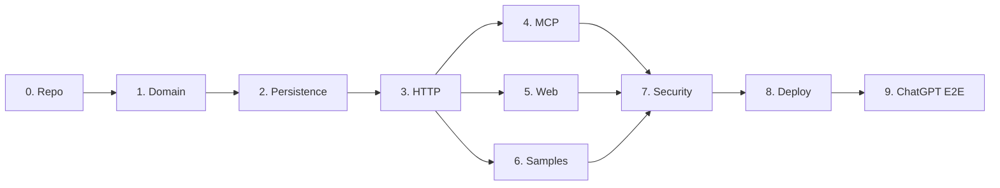

# MyFit Implementation Plan

**Status:** Sequenced plan for later coding sessions  
**Implementation status:** Phase 0 completed locally on 2026-07-29; remote CI awaits the first reviewed commit/push, and Phase 1 has not started.  
**Rule:** Each phase is a review gate. A later Codex session should implement only the explicitly authorized phase.

## Delivery sequence

Phases 4, 5, and 6 can be developed independently after Phase 3, but a single agent should still keep commits phase-scoped. Estimated implementation order is 0 → 1 → 2 → 3 → 4 → 5 → 6 → 7 → 8 → 9. This is a dependency sequence, not a time or price quote.

## Phase 0: repository setup and architecture enforcement

### Goals

Create the smallest reproducible TypeScript monorepo skeleton and encode architectural dependency rules before feature code.

### Expected files/packages

- Root `package.json`, `pnpm-workspace.yaml`, TypeScript/test/lint configuration.
- `apps/web`, `apps/server`.
- `packages/domain`, `application`, `persistence`, `assets`, `contracts`.
- `tools/operator`, `tools/sample-import`, `tools/export`.
- `.env.example`, `.gitignore`, CI workflow, architecture test/config.
- No database migration yet.

### Major tasks

- Pin Node and pnpm versions.
- Configure strict TypeScript, formatting, linting, unit tests, and build scripts.
- Establish package dependency direction from `DESIGN.md`.
- Define environment-variable names without real secrets.
- Add CI for install, typecheck, lint, unit tests, JSON validation, and build.
- Record local Windows commands using `pnpm.cmd`.

### Tests

- Clean checkout installs with the pinned toolchain.
- All empty package builds/tests run.
- An intentional forbidden import is rejected by the architecture rule.
- Secret-pattern check and `docs/SAMPLE_RECORDS.json` parse check run in CI.

### Completion criteria

- One documented command validates the repository.
- Packages are empty/minimal but import boundaries are enforced.
- CI passes on the GitHub default branch or review branch.

### Dependencies

Approved architecture documents only.

### Risks

- Tooling sprawl before product code.
- Windows/CI command differences.

### Must not build yet

Domain entities, provider clients, migrations, API handlers, MCP tools, UI, deployment, or sample import behavior.

## Phase 1: core domain and schemas

### Goals

Implement provider-neutral domain types, validators, policies, application ports, and pure use cases.

### Expected files/packages

- `packages/domain/src/{garment,draft,outfit,owner,asset,errors}.ts`
- `packages/contracts/src/{public,operator,mcp}.ts`
- `packages/application/src/use-cases/*`
- Validator fixtures/tests based on `docs/SAMPLE_RECORDS.json`.

### Major tasks

- Implement canonical, draft, owner, outfit, asset, material, category-attribute, and provenance schemas.
- Implement the `reachable` boolean invariant and default.
- Implement revision, approval, worn-photo completeness, publication-manifest, and public-projection policies as pure functions.
- Define repository and `AssetStore` ports.
- Build category alias normalization and search request validation.
- Separate public DTO construction from private aggregates.

### Tests

- Both approved sample records validate.
- Guessed labelled size, unknown JSON keys, public authenticated asset, and missing worn evidence fail correctly.
- Approval does not mutate a draft input.
- Public DTO tests prove private fields are absent.
- Property tests cover revision/idempotency inputs and array normalization.

### Completion criteria

- Domain and application packages have no provider/transport imports.
- All invariants in `docs/DATA_MODEL.md` have named tests.
- DTO snapshots contain only approved public fields.

### Dependencies

Phase 0.

### Risks

- Over-modeling category vocabularies.
- Confusing validation schemas with database row types.

### Must not build yet

Database access, HTTP, MCP, image upload, UI, AI extraction, or migrations.

## Phase 2: persistence and cloud integrations

### Goals

Persist the Phase 1 model in Supabase/Postgres and prove the private-original/public-copy Cloudinary boundary.

### Expected files/packages

- `supabase/migrations/<timestamp>_initial_schema.sql`
- `packages/persistence/src/*`
- `packages/assets/src/cloudinary/*`
- Local/test database configuration and integration tests.

### Major tasks

- Create tables, constraints, indexes, RLS, functions/transactions, and append-only audit policy from `docs/DATA_MODEL.md`.
- Seed only the configured owner identity/profile in local/test setup; do not auto-import garments.
- Implement repositories and transactional approval.
- Implement signed authenticated uploads, provider-result verification, immutable registration, public presentation-copy creation, and private signed export access.
- Make provider callbacks idempotent and signature-verified.
- Implement FTS vector/index and alias filters.

### Tests

- Migration applies to a blank database and can be reproduced from Git.
- RLS isolates owners and blocks anonymous table access.
- Public repository methods return only published rows/assets.
- Database checks reject invalid visibility combinations and cross-owner associations.
- Cloudinary adapter contract tests use recorded/sandbox provider behavior without leaking secrets.
- Provider copy failure leaves the draft unapproved.

### Completion criteria

- A local integration test can create a draft, register fake/fixture-backed private assets, approve privately or publicly, and query the expected projection.
- Originals cannot be overwritten.
- No provider delivery URL is stored as canonical identity.

### Dependencies

Phase 1 plus development Supabase/Cloudinary projects or controlled test doubles.

### Risks

- Cloudinary delivery-type semantics or free-plan behavior differs from documentation.
- Transaction boundary cannot include provider work.

### Must not build yet

Production endpoints, MCP, web UI, automatic fixture import, deployment, or generated imagery.

## Phase 3: authenticated HTTP API and public read API

### Goals

Expose stable public read contracts and a separately authenticated Codex/operator boundary over Netlify Functions.

### Expected files/packages

- `apps/server/src/http/public/*`
- `apps/server/src/http/operator/*`
- `apps/server/src/auth/*`
- `apps/server/src/middleware/{validation,errors,rate-limit,correlation}.ts`
- Function routing/configuration and API integration tests.

### Major tasks

- Implement `/api/public/v1` endpoints with explicit public DTOs, cursors, ETags, caching, and rate limits.
- Implement the minimum `/api/operator/v1` draft/upload/approval/publish/reachability operations.
- Verify Supabase JWTs for operator routes; no public signup path.
- Enforce idempotency and revision checks.
- Keep upload bytes direct from local operator to Cloudinary.
- Implement the local `tools/operator` commands necessary for authentication, manifest preview, upload, approve/publish, and readback verification.

### Tests

- Anonymous public reads succeed; anonymous writes and private reads fail.
- Published/private pairs prove no draft, original ID, filename, private note, or auth ID leaks.
- Operator token issuer/audience/expiry/signature tests.
- Idempotency replay/conflict and stale revision tests.
- Request-size, query-length, page-size, and rate-limit tests.
- Operator end-to-end test uses temporary fixture copies, never mutating `samples/`.

### Completion criteria

- Codex can drive an authenticated dry-run and test-environment ingestion flow.
- Public GET contract matches `docs/MCP_AND_API.md`.
- No image bytes traverse the function.

### Dependencies

Phase 2.

### Risks

- Local operator authentication ergonomics.
- Netlify request limits or runtime differences.

### Must not build yet

Mobile/browser upload UI, MCP writes, public editing, generic admin UI, or production deployment.

## Phase 4: MCP server

### Goals

Expose the five anonymous read-only MCP tools over stateless Streamable HTTP.

### Expected files/packages

- `apps/server/src/mcp/server.ts`
- `apps/server/src/mcp/tools/{search-garments,get-garment,search-outfits,get-outfit,get-owner-profile}.ts`
- `/mcp` function adapter and protocol tests.

### Major tasks

- Use the official MCP SDK and current protocol version.
- Register only the five tools documented in `docs/MCP_AND_API.md`.
- Map tool inputs to the same public-read application services as HTTP.
- Add accurate read-only annotations, bounded results, safe errors, and image/resource references supported by the current host.
- Validate with MCP Inspector and a deployed preview function.

### Tests

- Tool schema snapshots and unknown-input rejection.
- Every tool sees only published projections.
- No registered tool can reach operator application interfaces.
- Stateless initialize/list/call behavior works across independent invocations.
- Protocol, timeout, pagination, and rate-limit tests.

### Completion criteria

- MCP Inspector can initialize, list exactly five tools, and call each successfully.
- A deployed preview endpoint behaves the same as local.
- Security review finds no write-capable tool or private-data path.

### Dependencies

Phase 3 and current official MCP/OpenAI documentation recheck.

### Risks

- ChatGPT plan/workspace does not allow a custom no-auth MCP connection.
- Serverless Streamable HTTP behavior differs from local tests.

### Must not build yet

OAuth, write tools, attachment upload, prompts/resources not required by the five tools, or long-lived sessions.

## Phase 5: read-only frontend

### Goals

Build a small responsive public wardrobe browser over `/api/public/v1`.

### Expected files/packages

- `apps/web/src/routes/{catalog,garment,outfits,outfit}.tsx`
- Shared presentational components, API client, CSS/tokens, accessibility and browser tests.
- Netlify SPA/route configuration.

### Major tasks

- Catalog grid, detail pages, full-text search, reachability/category/color filters.
- Saved-outfit list/detail pages.
- Clear labels for documentary, derived, generated, collage, and real-worn assets.
- Responsive images using approved public presentation copies.
- Loading, empty, not-found, and provider-paused states.
- No authentication, cookies, edit controls, AI chat, or recommendation engine.

### Tests

- Unit/component tests for filters and image-role labels.
- Browser tests at phone and laptop viewports.
- Keyboard navigation, semantics, alt text, focus, contrast, and reduced-motion checks.
- Direct-route refresh and 404 behavior.
- Network inspection proves calls only public API/image origins.

### Completion criteria

- All required routes work at real rendered phone/laptop sizes.
- No private/operator contract is included in the browser bundle.
- Lighthouse/accessibility targets agreed in the phase are met.

### Dependencies

Phase 3. Can run alongside Phase 4.

### Risks

- Image-heavy pages consume Cloudinary/Netlify bandwidth.
- Public caching can obscure a recent unpublish.

### Must not build yet

Editing, uploading, account UI, chatbot, drag-and-drop outfits, recommendations, generated previews, or native apps.

## Phase 6: sample-data import tooling

### Goals

Turn the nine sample images and example records into explicit, repeatable non-production fixtures.

### Expected files/packages

- `samples/manifest.json` or a tool-owned fixture manifest (without renaming images).
- `tools/sample-import/src/*`
- Fixture validation and integration tests.

### Major tasks

- Encode exact paths, SHA-256 hashes, roles, and garment fixture IDs from `docs/SAMPLE_RECORDS.json`.
- Implement `--dry-run` as the default behavior.
- Require explicit `--apply --environment local|test`; require stronger confirmation for any production target.
- Refuse hash mismatches, unknown target environments, or implicit directory scans.
- Use the normal draft/approval services rather than special database writes.

### Tests

- All nine current hashes match.
- Dry-run makes no provider/database writes.
- Mutated or missing fixture fails safely.
- Repeated import is idempotent.
- Production is never selected by default.

### Completion criteria

- A clean local/test environment can reproduce the two garments without touching source files.
- Application startup and deployment never inspect/import `samples/`.

### Dependencies

Phase 3.

### Risks

- Fixture metadata diverges from canonical validators.
- Test imports accidentally target production.

### Must not build yet

Automatic seed-on-start, image renaming, real production upload without explicit approval, or new sample imagery.

## Phase 7: testing and security review

### Goals

Prove the full local/preview system honors publication, isolation, immutability, and narrow-tool boundaries.

### Expected files/packages

- Cross-package integration suite.
- Browser E2E suite.
- Threat-model test matrix and release checklist.
- Dependency/license/security scan configuration.

### Major tasks

- Test public/private projection leakage with canary private values.
- Test RLS with two synthetic owners despite single-owner product scope.
- Test JWT validation, query abuse, prompt-injection-shaped data, webhook forgery, SSRF absence, idempotency, and concurrency.
- Inspect built web artifacts/source maps for secrets/private contracts.
- Test unpublish cache invalidation and asset URL behavior.
- Run accessibility, performance, quota-conscious image, and backup/restore checks.

### Tests

This phase is the tests: unit, integration, contract, protocol, browser, security, export/restore, and deployed-preview smoke suites.

### Completion criteria

- Every V1 acceptance criterion in `DESIGN.md` has evidence.
- No high-severity finding remains.
- Focused suites and the whole repository suite pass.

### Dependencies

Phases 4–6.

### Risks

- Testing against real providers consumes quota.
- Cache behavior differs on deployed CDN.

### Must not build yet

Unrelated features offered as fixes, OAuth/write MCP, mobile upload, or production data.

## Phase 8: deployment

### Goals

Create reproducible Supabase, Cloudinary, Netlify, and GitHub production configuration and deploy only the verified release.

### Expected files/packages

- `netlify.toml`
- Deployment/runbook documentation.
- Production environment schema and secret checklist.
- Backup/export command and restore test evidence.

### Major tasks

- Recheck current free-tier limits and provider docs.
- Apply reviewed migrations.
- Configure owner identity, RLS, Cloudinary folders/presets/policies, function secrets, custom domain/TLS, headers, and rate limits.
- Set provider quota alerts/MFA.
- Deploy a saved release, run smoke tests against the production URL, and verify the actual served bundle.
- Produce and validate the first encrypted export.

### Tests

- Public pages/API/MCP from outside authenticated sessions.
- Operator calls rejected without token.
- Private original URL unavailable publicly.
- Cloudinary/Netlify caching and unpublish behavior.
- Production migration and rollback/runbook rehearsal.

### Completion criteria

- Production URL, build/version, public contracts, and private boundaries are verified.
- Export can be restored into an isolated test project.
- No sample is imported automatically; any real publication has explicit owner approval.

### Dependencies

Phase 7 and owner authorization to deploy.

### Risks

- Free Supabase pauses after inactivity.
- Provider quotas/pricing have changed.
- Production environment drifts from preview.

### Must not build yet

Custom domain purchases unless requested, paid upgrades without approval, CI auto-production deployment, or new product features.

## Phase 9: ChatGPT connection and end-to-end validation

### Goals

Connect the production read-only MCP server to ChatGPT and prove real outfit-suggestion retrieval over public wardrobe data.

### Expected files/packages

- Connection/runbook notes.
- Redacted MCP/ChatGPT acceptance evidence.
- Final operations checklist.

### Major tasks

- Refresh current OpenAI documentation and account/workspace entitlement.
- Add the production `/mcp` URL as a custom app/server using no authentication.
- Refresh tool definitions and confirm exactly five read tools.
- Run representative conversations: reachable jackets, outfit around sneakers, owner-profile-aware sizing context, saved outfit lookup.
- Separately run a Codex ingestion of one approved test/real item and verify ChatGPT can read it after publication.
- Confirm the app cannot change reachability or save outfits in MVP.

### Tests

- Tool calls return the production garment IDs and published images.
- `reachable=true` excludes unreachable items for wearable suggestions.
- Styling output distinguishes facts, uncertainty, and runtime advice.
- Attempts to request a write reveal no write tool.
- Unpublished/private canary records are not discoverable.

### Completion criteria

- ChatGPT can suggest outfits using current published wardrobe state.
- The Codex-to-publication-to-ChatGPT loop is demonstrated end to end.
- Actual account limitations and any fallback are documented.

### Dependencies

Phase 8.

### Risks

- Current ChatGPT plan lacks custom MCP connection access.
- Tool schemas remain cached until the app is refreshed.
- Public URLs can be shared and copied by design.

### Must not build yet

Write MCP, conversation-attachment ingestion, mobile upload, browser chat, automated suggestion persistence, or broader SaaS behavior.
