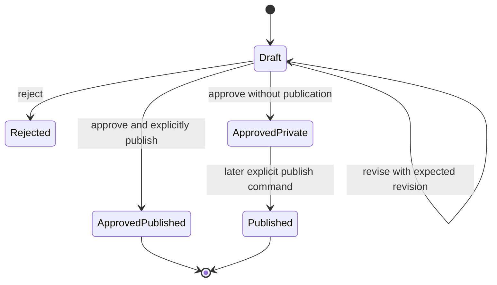

# MyFit Data Model

**Status:** V1 implementation contract  
**Database:** PostgreSQL on Supabase  
**Naming:** Database fields use `snake_case`; external JSON uses `camelCase`

## 1. Modeling rules

- UUIDs are generated server-side and are the only durable references between domain objects.
- Every owner-scoped row has `owner_id uuid not null`, even though V1 has one owner.
- Canonical records and drafts carry `schema_version integer not null`.
- Mutable aggregate roots carry `revision integer not null default 1`; every successful update increments it.
- Timestamps are UTC `timestamptz`.
- Unknown values are `null` or absent. Empty strings, `"unknown"`, and guessed ranges are invalid substitutes.
- JSONB is limited to validated category attributes, material statements, provenance, and redacted audit diffs.
- Public visibility is opt-in. `published_at is null` means private.
- Raw assets are private by default. Public presentation media is a separate asset object, not a flag applied to an original.

## 2. Enums

These may be PostgreSQL enums or constrained text. Constrained text is easier to extend safely; use one mechanism consistently.

| Name                        | Values                                                                                                                           |
| --------------------------- | -------------------------------------------------------------------------------------------------------------------------------- |
| `draft_status`              | `draft`, `approved`, `rejected`, `superseded`                                                                                    |
| `asset_class`               | `source`, `derived`, `generated`                                                                                                 |
| `asset_visibility`          | `private`, `public`                                                                                                              |
| `asset_verification_status` | `pending`, `verified`, `rejected`                                                                                                |
| `source_kind`               | `user_provided`, `direct_observation`, `manufacturer_claim`, `model_inference`, `system_derived`                                 |
| `fact_status`               | `confirmed`, `inferred`, `disputed`, `unknown`                                                                                   |
| `confidence`                | `high`, `medium`, `low`                                                                                                          |
| `garment_asset_role`        | `alone_front`, `alone_back`, `detail`, `label_material`, `worn_front`, `worn_back`, `worn_side`, `other`, `catalog`, `thumbnail` |
| `outfit_asset_role`         | `deterministic_collage`, `generated_worn_preview`, `real_worn_photo`                                                             |
| `outfit_item_role`          | `outer_layer`, `top`, `bottom`, `footwear`, `accessory`, `other`                                                                 |
| `audit_channel`             | `operator_api`, `mcp`, `webhook`, `sample_import`, `maintenance`                                                                 |

## 3. Tables

### 3.1 `owner_profiles`

Exactly one active row in V1. `id` equals or maps one-to-one to the Supabase Auth subject.

| Field                            | Type         | Required | Constraints/meaning                |
| -------------------------------- | ------------ | -------: | ---------------------------------- |
| `id`                             | uuid         |      yes | PK                                 |
| `schema_version`                 | integer      |      yes | `>= 1`                             |
| `revision`                       | integer      |      yes | `>= 1`                             |
| `gender_context`                 | text         |      yes | Styling context, initially `male`  |
| `age_range`                      | text         |      yes | Initially `20s`                    |
| `height_cm_approx`               | numeric(5,1) |      yes | `> 0`                              |
| `weight_kg_visualization_approx` | numeric(5,1) |      yes | `> 0`; visualization context only  |
| `shoe_size_system`               | text         |      yes | Initially `EU`                     |
| `shoe_size_approx`               | numeric(4,1) |      yes | `> 0`                              |
| `typical_clothing_size`          | text         |      yes | Initially `L`; not a garment label |
| `private_notes`                  | text[]       |      yes | Default `{}`; never public         |
| `created_at`                     | timestamptz  |      yes | Default `now()`                    |
| `updated_at`                     | timestamptz  |      yes | Maintained on writes               |

The anonymous `OwnerProfileView` allowlists only the seven styling fields. It excludes `id`, revision, timestamps, private notes, authentication data, and owner assets.

### 3.2 `garments`

| Field                     | Type        | Required | Constraints/meaning                            |
| ------------------------- | ----------- | -------: | ---------------------------------------------- |
| `id`                      | uuid        |      yes | PK                                             |
| `owner_id`                | uuid        |      yes | FK `owner_profiles(id)`                        |
| `schema_version`          | integer     |      yes | Initially `1`                                  |
| `revision`                | integer     |      yes | Optimistic concurrency                         |
| `display_name`            | text        |      yes | Trimmed, 1–160 chars                           |
| `brand`                   | text        |       no | Trimmed, max 120                               |
| `user_category`           | text        |      yes | Owner vocabulary, max 80                       |
| `system_category`         | text        |      yes | Normalized broad taxonomy, max 80              |
| `alternative_terms`       | text[]      |      yes | Default `{}`, unique normalized terms          |
| `reachable`               | boolean     |      yes | Default `true`; no associated reason/state     |
| `color_description`       | text        |      yes | Natural-language description                   |
| `color_families`          | text[]      |      yes | At least one normalized broad family           |
| `pattern_description`     | text        |       no | Objective description                          |
| `materials`               | jsonb       |      yes | Array of `MaterialStatement`, default `[]`     |
| `construction_details`    | text[]      |      yes | Default `{}`                                   |
| `visible_details`         | text[]      |      yes | Default `{}`                                   |
| `silhouette`              | text        |       no | Objective/owner-relative                       |
| `fit_on_owner`            | text        |       no | Owner-specific                                 |
| `length_on_owner`         | text        |       no | Owner-specific                                 |
| `thermal_weight`          | text        |       no | Small validated vocabulary or null             |
| `weather_characteristics` | text[]      |      yes | Stable practical facts only                    |
| `layering_role`           | text        |       no | Stable practical role                          |
| `labelled_size`           | text        |       no | Must be observed/user-provided; never inferred |
| `owner_notes`             | text[]      |      yes | Stable owner facts, default `{}`               |
| `category_attributes`     | jsonb       |      yes | Validated discriminated payload                |
| `provenance`              | jsonb       |      yes | Sparse JSON Pointer map, default `{}`          |
| `published_at`            | timestamptz |       no | Null is private; set only by explicit publish  |
| `created_at`              | timestamptz |      yes | Default `now()`                                |
| `updated_at`              | timestamptz |      yes | Maintained on writes                           |

Checks:

- `reachable` is the only availability field.
- Arrays contain trimmed, non-empty, deduplicated entries.
- `category_attributes.kind` must agree with the registered schema for `system_category`.
- Public queries require `published_at is not null`.

### 3.3 `garment_drafts`

Drafts never appear in the public API or MCP server.

| Field                             | Type           | Required | Constraints/meaning                      |
| --------------------------------- | -------------- | -------: | ---------------------------------------- |
| `id`                              | uuid           |      yes | PK                                       |
| `owner_id`                        | uuid           |      yes | FK                                       |
| `schema_version`                  | integer        |      yes | Proposed canonical schema                |
| `revision`                        | integer        |      yes | Optimistic concurrency                   |
| `status`                          | `draft_status` |      yes | Default `draft`                          |
| `proposed_record`                 | jsonb          |      yes | Full validated proposal; not canonical   |
| `provenance`                      | jsonb          |      yes | Sparse fact provenance                   |
| `missing_recommended_asset_roles` | text[]         |      yes | Completeness guidance                    |
| `source_summary`                  | text           |       no | Short summary, never raw chat transcript |
| `approved_garment_id`             | uuid           |       no | FK `garments(id)`, only when approved    |
| `created_at` / `updated_at`       | timestamptz    |      yes | Standard timestamps                      |
| `decided_at`                      | timestamptz    |       no | Required for terminal status             |

Constraints:

- `approved_garment_id` is non-null iff `status='approved'`.
- Only `draft` rows can be revised or approved.
- Terminal states are immutable except an administrative correction recorded in audit.

### 3.4 `upload_sessions`

| Field                | Type        | Required | Constraints/meaning             |
| -------------------- | ----------- | -------: | ------------------------------- |
| `id`                 | uuid        |      yes | PK                              |
| `owner_id`           | uuid        |      yes | FK                              |
| `draft_id`           | uuid        |      yes | FK `garment_drafts(id)`         |
| `intended_role`      | text        |      yes | Valid garment source role       |
| `max_bytes`          | integer     |      yes | Positive app cap                |
| `allowed_mime_types` | text[]      |      yes | Image allowlist                 |
| `provider_public_id` | text        |      yes | Server-generated unique ID      |
| `expires_at`         | timestamptz |      yes | Short lifetime                  |
| `consumed_at`        | timestamptz |       no | One-time registration semantics |
| `created_at`         | timestamptz |      yes | Standard timestamp              |

Cloudinary signatures are returned, never stored in this table.

### 3.5 `assets`

One row equals one immutable provider media object.

| Field                 | Type                        | Required | Constraints/meaning                                       |
| --------------------- | --------------------------- | -------: | --------------------------------------------------------- |
| `id`                  | uuid                        |      yes | PK                                                        |
| `owner_id`            | uuid                        |      yes | FK                                                        |
| `upload_session_id`   | uuid                        |       no | FK for uploaded originals                                 |
| `provider`            | text                        |      yes | V1: `cloudinary`                                          |
| `provider_asset_id`   | text                        |      yes | Stable provider identifier                                |
| `provider_public_id`  | text                        |      yes | Current delivery identifier                               |
| `provider_version`    | bigint                      |       no | Versioned delivery                                        |
| `resource_type`       | text                        |      yes | V1: `image`                                               |
| `delivery_type`       | text                        |      yes | `authenticated` for originals, `upload` for public copies |
| `asset_class`         | `asset_class`               |      yes | Documentary distinction                                   |
| `visibility`          | `asset_visibility`          |      yes | Default `private`                                         |
| `parent_asset_id`     | uuid                        |       no | FK `assets(id)` for derivative lineage                    |
| `mime_type`           | text                        |      yes | Allowlisted                                               |
| `byte_size`           | bigint                      |      yes | `> 0`                                                     |
| `width` / `height`    | integer                     |      yes | `> 0`                                                     |
| `sha256`              | text                        |       no | 64 lowercase hex chars when known                         |
| `original_filename`   | text                        |       no | Operator-only metadata                                    |
| `transformation_spec` | jsonb                       |       no | Exact immutable transform for derivative                  |
| `verification_status` | `asset_verification_status` |      yes | Default `pending`                                         |
| `immutable`           | boolean                     |      yes | Must be true in V1                                        |
| `published_at`        | timestamptz                 |       no | Required iff public                                       |
| `created_at`          | timestamptz                 |      yes | Standard timestamp                                        |

Critical checks:

- `visibility='public'` requires `asset_class in ('derived','generated')`, `delivery_type='upload'`, `published_at is not null`, and `verification_status='verified'`.
- `delivery_type='authenticated'` requires `visibility='private'`.
- A public derived asset requires a private or public parent owned by the same owner.
- `(provider, provider_asset_id)` is unique.
- A checksum match is advisory deduplication, never permission to overwrite.

### 3.6 `garment_assets`

| Field           | Type                 | Required | Constraints/meaning             |
| --------------- | -------------------- | -------: | ------------------------------- |
| `garment_id`    | uuid                 |      yes | FK                              |
| `asset_id`      | uuid                 |      yes | FK                              |
| `role`          | `garment_asset_role` |      yes | Documentary/presentation role   |
| `position`      | integer              |      yes | `>= 0`                          |
| `is_primary`    | boolean              |      yes | Default false                   |
| `superseded_at` | timestamptz          |       no | Historical association retained |
| `created_at`    | timestamptz          |      yes | Standard timestamp              |

PK `(garment_id, asset_id, role)`. At most one non-superseded primary asset per garment and public presentation role.

### 3.7 `draft_assets`

Same association shape as `garment_assets`, but `draft_id` replaces `garment_id`. It may link only assets owned by the draft owner. Uploading or linking does not approve the draft.

### 3.8 `asset_variants`

Tracks named provider transformations without implying visibility.

| Field                 | Type        | Required | Constraints/meaning                                |
| --------------------- | ----------- | -------: | -------------------------------------------------- |
| `id`                  | uuid        |      yes | PK                                                 |
| `source_asset_id`     | uuid        |      yes | FK                                                 |
| `result_asset_id`     | uuid        |      yes | FK, unique                                         |
| `name`                | text        |      yes | Initially `catalog` or `thumbnail`                 |
| `transformation_spec` | jsonb       |      yes | Exact provider-neutral intent plus provider params |
| `created_at`          | timestamptz |      yes | Standard timestamp                                 |

Unique `(source_asset_id, name, transformation_spec_hash)`.

### 3.9 `looks` (current static MVP projection)

The current repository JSON has a top-level `looks` collection for real photographed combinations.
Each look has an ID, title, notes, occasions, seasons, tags, `unindexedPieces`, a `privacyTreatment`,
and one or more images. Each image extends the normal public image record with a non-empty
`garmentIds` array, nullable `variantLabel`, and its own `unindexedPieces`. This per-photo association
is deliberate: opened/closed layers, unresolved pieces, and swapped footwear can change between
images in the same look. The look-level `unindexedPieces` is a validated union used for summary
display; the image-level values are authoritative. All garment IDs must reference existing garments.

`privacyTreatment="as-is"` is the current owner-only policy. A future multi-user intake surface must
offer default-on face and background redaction before this becomes a service feature.

### 3.10 `outfits`

| Field                       | Type        | Required | Constraints/meaning                          |
| --------------------------- | ----------- | -------: | -------------------------------------------- |
| `id`                        | uuid        |      yes | PK                                           |
| `owner_id`                  | uuid        |      yes | FK                                           |
| `schema_version`            | integer     |      yes | Initially `1`                                |
| `revision`                  | integer     |      yes | Optimistic concurrency                       |
| `title`                     | text        |      yes | 1–160 chars                                  |
| `original_request`          | text        |      yes | User's request, max bounded                  |
| `rationale`                 | text        |       no | Short, contextual, not a compatibility score |
| `notes`                     | text[]      |      yes | Default `{}`                                 |
| `tags`                      | text[]      |      yes | Normalized, default `{}`                     |
| `published_at`              | timestamptz |       no | Null is private                              |
| `archived_at`               | timestamptz |       no | Archived rows are not public                 |
| `created_at` / `updated_at` | timestamptz |      yes | Standard timestamps                          |

### 3.11 `outfit_items`

| Field        | Type               | Required | Constraints/meaning       |
| ------------ | ------------------ | -------: | ------------------------- |
| `outfit_id`  | uuid               |      yes | FK                        |
| `garment_id` | uuid               |      yes | FK                        |
| `position`   | integer            |      yes | `>= 0`, unique per outfit |
| `role`       | `outfit_item_role` |       no | Neutral structural role   |

PK `(outfit_id, garment_id)`. Garment and outfit must share an owner. Public outfit projections include only published garments; publication fails if any member garment is private.

### 3.12 `outfit_assets`

Association of outfit to asset with `role`, `position`, and optional disclaimer. A generated preview must reference an `asset_class='generated'` asset and must carry the standard inaccuracy disclaimer.

### 3.13 `idempotency_records`

| Field             | Type        | Required | Constraints/meaning             |
| ----------------- | ----------- | -------: | ------------------------------- |
| `owner_id`        | uuid        |      yes | Scope                           |
| `operation`       | text        |      yes | Stable operation name           |
| `idempotency_key` | text        |      yes | Client-generated UUID preferred |
| `request_hash`    | text        |      yes | Canonical request digest        |
| `response_status` | integer     |      yes | Original result                 |
| `response_body`   | jsonb       |      yes | Redacted/replayable result      |
| `expires_at`      | timestamptz |      yes | Retention policy                |
| `created_at`      | timestamptz |      yes | Standard timestamp              |

Unique `(owner_id, operation, idempotency_key)`. Same key/different hash returns a conflict.

### 3.14 `audit_events`

Append-only.

| Field                                | Type            | Required | Constraints/meaning                          |
| ------------------------------------ | --------------- | -------: | -------------------------------------------- |
| `id`                                 | uuid            |      yes | PK                                           |
| `owner_id`                           | uuid            |      yes | FK                                           |
| `actor_id`                           | uuid            |       no | Auth subject; system callbacks may be null   |
| `channel`                            | `audit_channel` |      yes | Origin                                       |
| `action`                             | text            |      yes | Stable verb                                  |
| `target_type`                        | text            |      yes | Allowlisted aggregate type                   |
| `target_id`                          | uuid            |      yes | Aggregate ID                                 |
| `correlation_id`                     | uuid            |      yes | Request trace                                |
| `idempotency_key`                    | text            |       no | Write replay link                            |
| `before_redacted` / `after_redacted` | jsonb           |       no | No tokens, raw prompts, URLs, or image bytes |
| `created_at`                         | timestamptz     |      yes | Default `now()`                              |

No update/delete permissions are granted to application roles.

## 4. Validated JSONB shapes

### `MaterialStatement`

```json
{
  "name": "ECONYL regenerated nylon",
  "component": "main fabric",
  "percentage": null,
  "qualifier": "manufacturer-listed"
}
```

`name` is required. `component`, `percentage`, and `qualifier` are optional. Percentage is 0–100 and is never inferred.

### `category_attributes`

Every value has:

```json
{
  "kind": "footwear",
  "version": 1,
  "shoeType": "sneaker",
  "height": "low-top",
  "closure": ["laces"],
  "toeShape": null,
  "soleShape": "thick sculpted ridged sole",
  "upperConstruction": "mixed-panel construction",
  "labelledSize": null
}
```

Initial validators:

- `outerwear@1`: optional `collar`, `closure[]`, `hem`, `sleeveConstruction`, `pockets[]`, `insulation`, `layeringRole`.
- `top@1`: optional `collar`, `neckline`, `closure[]`, `hem`, `sleeveConstruction`, `pockets[]`.
- `trousers@1`: optional `rise`, `legShape`, `length`, `pleats`, `closure[]`, `breakOnOwner`.
- `footwear@1`: optional `shoeType`, `toeShape`, `soleShape`, `closure[]`, `upperConstruction`, `height`, `labelledSize`.
- `jewellery@1`: optional `objectType`, `materials[]`, `finish`, `dimensions`.
- `bag@1`: optional `bagType`, `closure[]`, `carryMethods[]`, `dimensions`.
- `accessory@1`: optional `objectType`, `dimensions`.

Unknown properties are rejected. A genuinely useful uncommon detail belongs temporarily in `construction_details` or `visible_details`, then earns a schema field only after repeated need.

### `provenance`

Object keyed by JSON Pointer into the proposed/canonical DTO:

```json
{
  "/materials/0/name": {
    "sourceKind": "model_inference",
    "status": "inferred",
    "confidence": "low",
    "sourceAssetId": "00000000-0000-0000-0000-000000000002",
    "note": "Appears suede-like; no label evidence."
  }
}
```

Only uncertain, disputed, inferred, or otherwise provenance-sensitive facts need entries. JSON Pointers must resolve to a value or explicitly documented null in the same record.

## 5. Public projections

Public readers never receive database rows directly.

- `PublicGarmentView`: published canonical fields, public asset DTOs, no `owner_id`, private provider metadata, original filename, private notes, draft link, or audit data.
- `PublicOutfitView`: published outfit fields and published garment summaries.
- `OwnerProfileView`: allowlisted styling fields only.
- `PublicAssetView`: application asset UUID, role, class, computed `evidenceKind`, width, height, MIME type, immutable versioned public URL, alt text, and generated-content disclaimer where applicable. `evidenceKind="documentary_source_presentation"` means a sanitized public copy of a private source photograph; it does not pretend the public copy is the immutable original.

Every public repository query includes publication predicates. Serialization uses explicit object construction, not `{...row}` spreading.

## 6. Indexes

- `garments(owner_id, reachable)`.
- `garments(owner_id, system_category)`.
- Partial public indexes on `garments(published_at) where published_at is not null` and `outfits(published_at) where published_at is not null and archived_at is null`.
- GIN on `garments.color_families`, `alternative_terms`, and `outfits.tags`.
- Generated garment `search_vector` with a GIN index.
- `garment_assets(garment_id, role, position)` and `outfit_items(garment_id, outfit_id)`.
- `assets(owner_id, visibility, verification_status)`.
- Unique provider ID and idempotency indexes described above.
- `audit_events(owner_id, created_at desc)` and `(target_type, target_id, created_at desc)`.

## 7. Draft, approval, and publication lifecycle



Approval and publication can occur in one operator transaction, but they are separate decisions in the command. The confirmation shown in Codex must list:

- canonical facts being approved;
- private originals being retained;
- exact public presentation asset IDs/roles;
- whether face, body, home interior, labels, or other personal context remains visible;
- public profile fields used by styling tools.

Approval validates the draft and creates canonical data. Publication additionally validates that every public asset is a verified public copy and that the canonical aggregate is eligible for the public projection.

## 8. Validation examples

- `reachable: "yes"` → `VALIDATION_ERROR`; no coercion.
- `labelledSize: "M or L"` without evidence → `VALIDATION_ERROR`; store `null`.
- public asset with `delivery_type='authenticated'` → database check failure.
- public garment referencing only a private primary image → `PUBLICATION_NOT_READY`.
- footwear draft with no worn source → `MISSING_REQUIRED_ASSET`, unless an allowed, audited exception is supplied.
- approval with stale `expectedRevision` → `REVISION_CONFLICT`.
- second approval with the same idempotency key and identical body → original success response.
- same idempotency key with a different body → `IDEMPOTENCY_CONFLICT`.
- outfit publication containing an unpublished garment → `PUBLICATION_NOT_READY`.

## 9. Migration/versioning contract

- Database migrations are timestamped, append-only SQL under `supabase/migrations/`.
- Record and category versions are independent of migration numbers.
- Readers are deployed before backfills and constraint tightening.
- Each category-version change includes a validator, old-version reader, deterministic upgrader, fixture tests, and an export compatibility test.
- No production schema change exists only in the Supabase dashboard.
