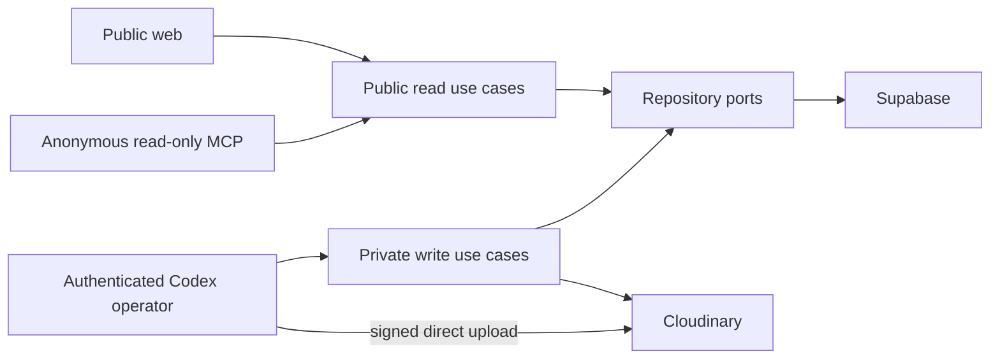

# MyFit MCP and HTTP API Contract

## Current static MVP (implemented)

The deployed MVP currently uses repository-owned JSON rather than the future database contract
below. Its public routes are `/api/catalog`, `/api/profile`, `/api/garments`, `/api/looks`,
`/api/outfits`, and `/api/outfit-options`, plus corresponding `/:id` routes.

Two records intentionally remain distinct:

- a **look** is photo-backed evidence and stores exact `garmentIds` on every image;
- an **outfit** is a saved combination idea and must not be described as photographed.

`GET /api/looks` accepts repeatable `garmentId`. `match=contains` (the default) means every requested
garment must occur in the same photo while allowing additional pieces. `match=exact` requires the
photo's indexed garment set to be identical. `GET /api/outfit-options` accepts request text plus
optional required garments, season, occasion, location, date, temperature, precipitation, forecast
summary, and mood.

Filtered look results return both `images` and `matchingImages`. `images` is the complete related
look family; `matchingImages` is the authoritative subset in which every requested garment occurs
in that individual photo. Each image also carries its `variantLabel` and image-specific
`unindexedPieces`, so ChatGPT can distinguish photographed variants without implying that a piece
appears in all photos.

The current MCP adds `find_worn_looks` and `get_outfit_options`. The latter is the normal one-call
tool for “what should I wear?” requests: tier 1 returns ranked photographed looks; tier 2 returns
ranked individual owned garments by category. ChatGPT should obtain current external context such as
the requested date's forecast when available, pass it to the tool, prefer a genuinely suitable tier
1 result, use its `matchingImages` as evidence for required-garment claims, and otherwise assemble
and explicitly label an unphotographed tier 2 suggestion.

The remainder of this document is the future authenticated/database design and is not a statement
that those routes or persistence services are currently deployed.

**Status:** V1 implementation contract  
**Public base:** `/api/public/v1`  
**Private operator base:** `/api/operator/v1`  
**MCP endpoint:** `/mcp` using stateless Streamable HTTP

## 1. Boundary and trust model

The public website and ChatGPT read the same published application projections. The operator surface is used only by the Codex-driven local workflow and maintenance tooling.



The MCP adapter does not import or dispatch operator commands. No transport exposes SQL, arbitrary table names, arbitrary JSON paths, provider secrets, or generic asset attachment.

## 2. Common conventions

- JSON request/response fields use `camelCase`.
- IDs are UUID strings.
- Timestamps are RFC 3339 UTC.
- Public list endpoints use opaque cursor pagination, default 24, maximum 100.
- Search text is trimmed and bounded to 200 characters.
- Write bodies are schema-validated with unknown keys rejected.
- Public responses use `Cache-Control` and an `ETag` based on the public projection revision.
- Every response includes `X-Correlation-Id`.
- Operator writes require `Authorization: Bearer <Supabase JWT>` and `Idempotency-Key: <UUID>`.
- Revision-sensitive writes require `expectedRevision`.
- Image bytes never pass through Netlify Functions.

## 3. Public HTTP endpoints

### `GET /api/public/v1/profile`

Returns the allowlisted styling profile:

```json
{
  "data": {
    "schemaVersion": 1,
    "genderContext": "male",
    "ageRange": "20s",
    "heightCmApprox": 180,
    "weightKgVisualizationApprox": 80,
    "shoeSizeSystem": "EU",
    "shoeSizeApprox": 44,
    "typicalClothingSize": "L"
  }
}
```

### `GET /api/public/v1/garments`

Query parameters:

| Parameter   | Type    | Behavior                                                          |
| ----------- | ------- | ----------------------------------------------------------------- |
| `q`         | string  | Full-text search                                                  |
| `reachable` | boolean | Omitted returns both; styling clients should normally send `true` |
| `category`  | string  | Matches user category, system category, or normalized alias       |
| `color`     | string  | Exact normalized color-family filter; repeatable                  |
| `cursor`    | string  | Opaque continuation                                               |
| `limit`     | integer | 1–100                                                             |

Returns published summaries only. Default sorting is relevance when `q` exists, otherwise `updatedAt desc, id`.

### `GET /api/public/v1/garments/{garmentId}`

Returns a published canonical garment, provenance appropriate for public reasoning, and only public presentation assets. A public copy derived from a private documentary photograph is labeled `evidenceKind: "documentary_source_presentation"`; genuinely generated or materially transformed imagery remains distinct. Private source asset counts, IDs, filenames, and signed URLs are excluded.

### `GET /api/public/v1/outfits`

Filters: `q`, repeatable `tag`, `garmentId`, `cursor`, `limit`. Returns non-archived published outfit summaries.

### `GET /api/public/v1/outfits/{outfitId}`

Returns a published outfit and ordered published garment summaries. A missing, private, or archived record returns the same `404`.

### `GET /api/public/v1/health`

Shallow process/version health only. It contains no provider identifiers or environment details.

## 4. Private operator endpoints

These contracts support Codex-only MVP ingestion. They are not called by the public web or MCP adapter.

### Drafts

- `POST /api/operator/v1/garment-drafts` — create a proposed record.
- `GET /api/operator/v1/garment-drafts/{draftId}` — private draft detail.
- `PATCH /api/operator/v1/garment-drafts/{draftId}` — replace/patch allowlisted proposal fields with `expectedRevision`.
- `POST /api/operator/v1/garment-drafts/{draftId}/reject` — terminal rejection.
- `POST /api/operator/v1/garment-drafts/{draftId}/approve` — create canonical garment, optionally publish.

Approval input:

```json
{
  "expectedRevision": 3,
  "publish": true,
  "publicPresentationAssets": [
    {
      "privateSourceAssetId": "c9cccd80-b6ec-4aa5-89a6-2c31aa17af76",
      "role": "catalog",
      "transformationProfile": "catalog-v1",
      "privacyAcknowledgements": ["home_interior_visible"]
    }
  ],
  "wornAssetException": null
}
```

The server creates or verifies the public copies; a client cannot supply a delivery URL. Approval is transactional at the database level, not across Cloudinary. The server first reserves private/pending derivative rows with opaque IDs, creates the selected provider objects, then promotes them and creates the garment in one database transaction. If provider work fails, the draft stays `draft`. If the database step fails, best-effort cleanup plus stale-pending reconciliation removes orphaned provider objects. Public readers require committed `visibility=public` and `publishedAt`, so a partial operation is never advertised.

### Uploads and assets

- `POST /api/operator/v1/garment-drafts/{draftId}/upload-sessions` — create a short-lived, role-bound Cloudinary signature.
- `POST /api/operator/v1/upload-sessions/{sessionId}/complete` — verify provider result and register the private asset.
- `GET /api/operator/v1/garment-drafts/{draftId}/assets` — private completeness/status view.

Upload-session request:

```json
{
  "role": "wornFront",
  "filename": "IMG_1234.jpeg",
  "mimeType": "image/jpeg",
  "byteSize": 3210456,
  "sha256": "64-lowercase-hex-characters"
}
```

Upload-session response contains Cloudinary endpoint, timestamp, signature, API key, server-generated `publicId`, forced authenticated delivery type, expiration, and accepted parameters. It never contains the API secret.

Completion accepts the provider response fields needed for verification. The server independently verifies signature, public ID, delivery type, bytes, dimensions, and ownership context.

### Canonical maintenance

- `PATCH /api/operator/v1/garments/{garmentId}` — allowlisted factual corrections only.
- `PUT /api/operator/v1/garments/{garmentId}/reachability` — body `{ "reachable": false, "expectedRevision": 4 }`.
- `POST /api/operator/v1/garments/{garmentId}/publish` — explicit metadata/asset publication.
- `POST /api/operator/v1/garments/{garmentId}/unpublish` — removes public reachability without deleting canonical data.
- `POST /api/operator/v1/outfits` — explicitly save an outfit.
- `POST /api/operator/v1/outfits/{outfitId}/publish` and `/unpublish`.

V1 may implement only the operator operations needed for ingestion plus reachability maintenance. Outfit creation is sequenced after the garment core but stays outside MCP until write support is deliberately enabled.

## 5. MVP MCP tools

All five tools are anonymous reads and call only published-read services.

### `search_garments`

Input:

```json
{
  "query": "brown jacket",
  "reachable": true,
  "category": "jacket",
  "colorFamilies": ["brown", "grey"],
  "limit": 20,
  "cursor": null
}
```

Output: concise garment summaries, public primary-image references, applied filters, next cursor, and a reminder that `reachable=true` is appropriate for currently wearable suggestions.

### `get_garment`

Input: `{ "garmentId": "<uuid>" }`.

Output: full published objective record, public provenance, public presentation images, and current reachability. It does not return private originals.

### `search_outfits`

Input supports `query`, `tags`, `garmentId`, `limit`, and `cursor`.

Output: published saved-outfit summaries. It never persists a suggestion.

### `get_outfit`

Input: `{ "outfitId": "<uuid>" }`.

Output: the published outfit, ordered garments, asset-class labels, and disclaimer for generated visuals.

### `get_owner_profile`

Input: `{}`.

Output: the allowlisted public styling profile. Tool description states that approximate height/weight are practical visualization context and must not be used for body judgment.

Tool annotations/descriptions must say that these are read-only, public-data operations. The server advertises no write tools in V1.

## 6. Post-MVP MCP writes

Do not register these during MVP:

- `create_garment_draft`
- `get_garment_draft`
- `update_garment_draft`
- `approve_garment_draft`
- `update_garment`
- `set_garment_reachable`
- `save_outfit`

If enabled later, they use OAuth 2.1, exact owner authorization, idempotency, revision checks, audit events, and accurate write/destructive annotations. Authentication does not expand a tool's allowlisted fields.

There is intentionally no `execute_sql`, `query_database`, `attach_asset`, `delete_garment`, generic patch-path, URL-fetch, or arbitrary Cloudinary transformation tool.

## 7. Error model

HTTP errors:

```json
{
  "error": {
    "code": "REVISION_CONFLICT",
    "message": "The draft changed since it was reviewed.",
    "details": {
      "currentRevision": 4
    },
    "correlationId": "8d2fe332-1cd6-43bb-bb9b-daee9bf4cab8"
  }
}
```

Stable codes:

| Code                     | HTTP | Meaning                                                 |
| ------------------------ | ---: | ------------------------------------------------------- |
| `VALIDATION_ERROR`       |  400 | Schema or semantic validation failed                    |
| `UNAUTHENTICATED`        |  401 | Missing/invalid operator token                          |
| `FORBIDDEN`              |  403 | Authenticated actor cannot perform action               |
| `NOT_FOUND`              |  404 | Missing or not visible; do not reveal private existence |
| `REVISION_CONFLICT`      |  409 | Stale expected revision                                 |
| `IDEMPOTENCY_CONFLICT`   |  409 | Reused key with different body                          |
| `DRAFT_NOT_APPROVABLE`   |  409 | Wrong lifecycle state                                   |
| `MISSING_REQUIRED_ASSET` |  422 | Required worn/source role missing                       |
| `PUBLICATION_NOT_READY`  |  422 | Public-copy/privacy requirements unmet                  |
| `RATE_LIMITED`           |  429 | Retry after bounded delay                               |
| `PROVIDER_ERROR`         |  502 | Cloud provider operation failed safely                  |
| `INTERNAL_ERROR`         |  500 | Redacted unexpected failure                             |

MCP maps expected errors to a structured tool result with `code`, safe message, remediation, and correlation ID. Transport/protocol failures remain protocol errors. Public not-found responses never reveal whether an unpublished record exists.

## 8. Idempotency and concurrency

- Every operator `POST`, `PUT`, and `PATCH` requires `Idempotency-Key`.
- The server hashes the canonical validated request.
- Same owner + operation + key + same hash returns the original response.
- Same key + different hash returns `IDEMPOTENCY_CONFLICT`.
- Aggregate writes compare `expectedRevision` inside the transaction.
- Cloudinary completion is idempotent on provider asset ID and upload-session ID.
- Webhooks deduplicate provider event identity/signature material.

## 9. Approval and publication semantics

`approve` is not a loose status update. It:

1. Locks and revalidates the draft revision.
2. Verifies private assets and category completeness.
3. Validates the proposed canonical schema.
4. Prepares/validates each explicitly selected public presentation copy.
5. Creates the canonical garment and associations.
6. Sets `publishedAt` only when `publish=true`.
7. Marks the draft approved.
8. Appends a redacted audit event.

Codex must show the user the exact publication manifest before calling this operation. Raw originals are never selected for public delivery. An inferred fact may be approved while retaining inferred provenance; approval does not magically make it observed.

## 10. Search behavior

- Postgres `websearch_to_tsquery` over canonical text.
- Category aliases normalize owner vocabulary before querying.
- Color filters match normalized families, not prose substrings.
- Reachability is an explicit filter. The database does not infer it from any other field.
- Public search always includes published predicates.
- Drafts are searched only through a private draft-specific operator operation, if later needed.
- Deterministic ordering includes ID as a tiebreaker.
- No embeddings or style scores.

## 11. Codex ingestion sequence

1. Codex reads local/attached images and checks exact fixture/file identity.
2. It builds a local proposal distinguishing observed, provided, inferred, and unknown facts.
3. It asks only useful clarifications and shows missing recommended views.
4. The owner approves both canonical facts and the exact public image/privacy manifest.
5. The local operator authenticates and creates a draft.
6. For each file, it requests a role-bound signed upload, uploads directly to Cloudinary, and completes registration.
7. It calls approval with revision and publication instructions.
8. It verifies the new public API and MCP readback.

No browser upload UI and no assumed ChatGPT attachment forwarding are required.

## 12. Rate limits and caching

- Public API/MCP: per-IP/request-key limits, conservative tool limits, maximum page size, and bounded query complexity.
- Operator API: tighter authentication-failure limits and per-owner write limits.
- Public GETs: short shared cache for metadata plus ETag revalidation.
- Public Cloudinary presentation assets: immutable versioned URLs and long cache lifetime.
- Private signed original URLs: short lifetime and `private` caching behavior.
- Rate limits mitigate abuse and cost; they do not make public data private.
